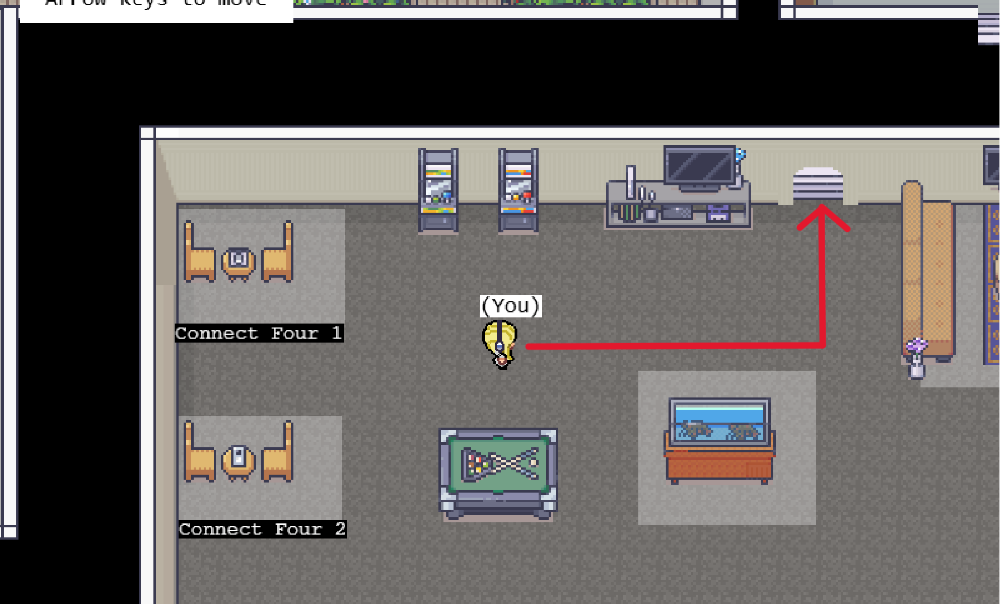
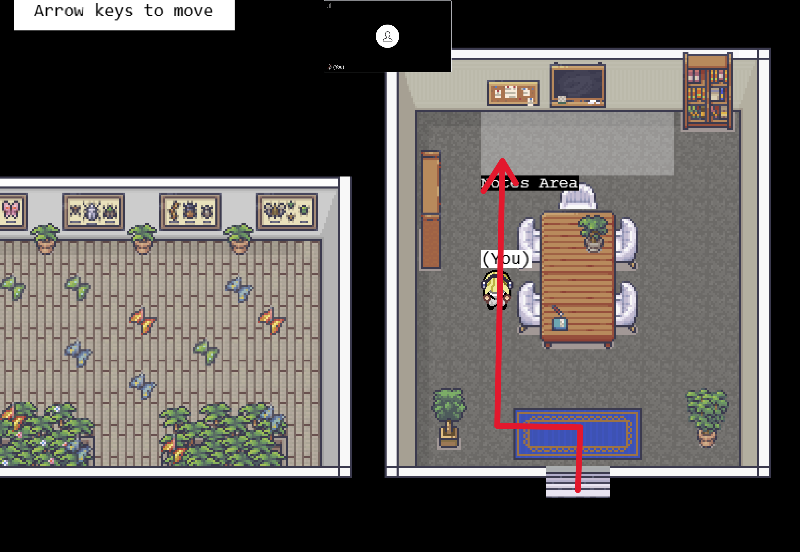
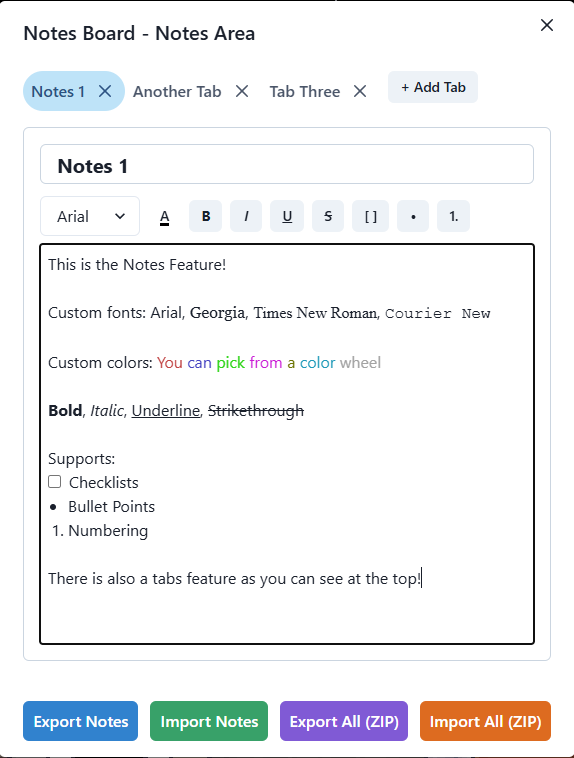

# Collaborative Notes Feature

Our team values the ability to take and share notes during online meetings. Leaving Covey.Town to create or update notes elsewhere disrupts collaboration and makes it harder to revisit past discussions. Without notes, meetings can become repetitive and progress may become disorganized.

Keeping documentation within Covey.Town allows multiple users to view and edit the same document in real time. We believe have added a real-time collaborative document system to Covey.Town to greatly improve productivity and teamwork.

## Running Covey.Town
If you plan use this feature locally, you must have Covey.Town properly set up. Please see the README at https://github.com/kelloggm/covey.town. 

Otherwise, please visit our link to use this feature: http://localhost:3000/

## Using Notes Feature

### Navigating To Feature Space

There is a new door to an office room which houses the interactive notes area.

### Notes Editor

### Import/Export
To save your notes across sessions, we have added the import and export options. 

**Export** will take your notes, turn them into an HTML file, and download them to your computer as <u>notes.html</u> through your browser. 

**Import** will open your local directory and prompt you to choose an HTML file to upload.

**WARNING!!!** Any edits made to the HTML file that are not supported features such as images/GIFs/etc. will not upload properly in covey.town.